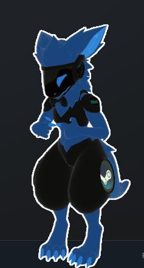

# VRChat ToolBox


Hello people! I hope you like my ToolBox. I spent quite a while making this to make managing and launching VRChat companion tools as easy and seamless as possible. Since this is a solo passion project, some bugs are expected—please report any issues or feedback on our Discord server!

✨ **The Discord Server:** [Join here!](https://discord.gg/YDXpQPF6g9)

---

## 🚀 Key Features

* **All-in-One Dashboard:** Launch and control all your VRChat OSC tools (Chatbox, Router, Gamepad, Face Tracking Controller, Parameter Browser, Script Maker, etc.) from a single beautiful Qt-based dashboard.
* **Libre Hardware Monitor Integration:** Automatically downloads, extracts, and integrates Libre Hardware Monitor to monitor and display system performance directly.
* **Intelligent Configurations:** Maintains localized configuration targets and automatically wipes legacy configurations on version upgrades to prevent breaking layout mismatches.
* **Bulletproof In-Place Self-Updater:** Automatically detects updates from GitHub. If packaged as a standalone executable, it uses an advanced Windows rename-and-replace routine to update itself in-place without needing manual downloads!
* **High-Resolution Graphics:** Features crisp, scaling vector graphics and a high-resolution 256x256 application icon for a gorgeous desktop experience.

---

## 💻 Installation & Usage

### Windows
1. Go to the **Releases** tab on GitHub.
2. Download the latest `VRChat-ToolBox.exe` (or run the installer `VRChat-ToolBox-Setup.exe`).
3. Run the executable and enjoy!

*(I have made this unbelievably simple, I believe in you all—you can do it! :3)*

### Linux (Tested & Supported)
To run the ToolBox directly from source on Linux:
```bash
# Clone the repository
git clone https://github.com/CaptainBoots/VRChat-ToolBox.git
cd VRChat-ToolBox

# Run with Python
python3 VRChat-ToolBox.py
```

*(If you encounter any platform-specific issues on Linux, please let me know in the Discord server!)*

---

## 🛠️ Advanced: The Robust Self-Updater

Under the hood, VRChat ToolBox features a custom-engineered self-update mechanism designed specifically for Windows PyInstaller packages:
* **No-Lock Rename:** Because Windows locks active running executables, the ToolBox dynamically renames its running binary to `ToolBox.exe.bak` (supporting incrementing suffixes like `.bak.1`, `.bak.2` to resolve any local collisions).
* **Safe Downloading:** It streams the new compiled binary from GitHub Releases directly to the original path. If the network drops or the file is unavailable, it automatically rolls back your previous executable so you never lose your app.
* **Automated Cleanup:** On next launch, the application uses wildcard pattern globbing to identify and cleanly purge all old `.bak` backup files from your directory.

---

## 📦 Troubleshooting & Development

### Antivirus False Positives
PyInstaller executables are sometimes flagged as false positives by Windows Defender or other security scanners. If the executable is blocked or cannot be deleted/compiled, add the installation or workspace folder to your antivirus exclusion list.

### Locked Executables
If compiling with PyInstaller fails with a `PermissionError` (Access Denied), ensure that PyCharm, VS Code, or any background instances of `ToolBox.exe` are completely closed so they release their locks.

---

I try my best so this will occasionally get updates. Sorwy if it takes ages 3:


